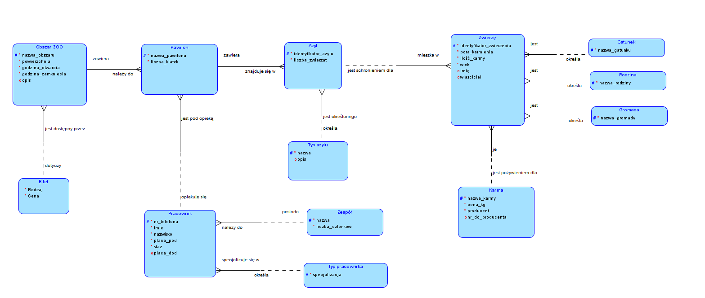
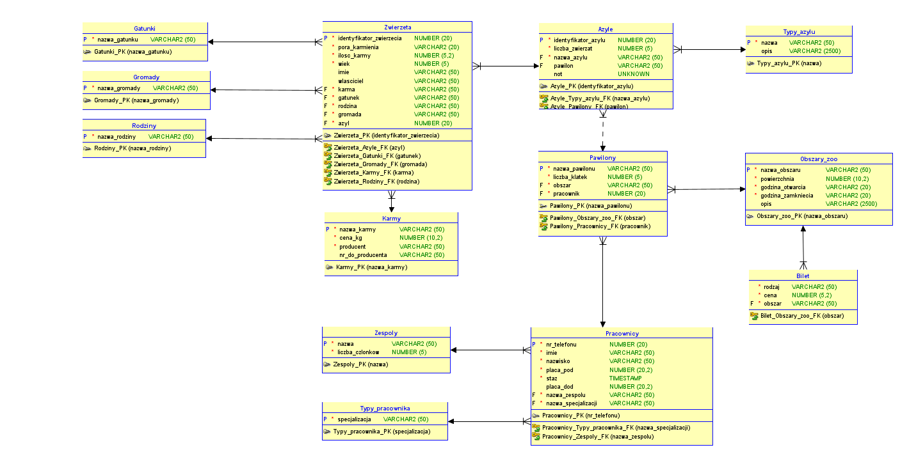
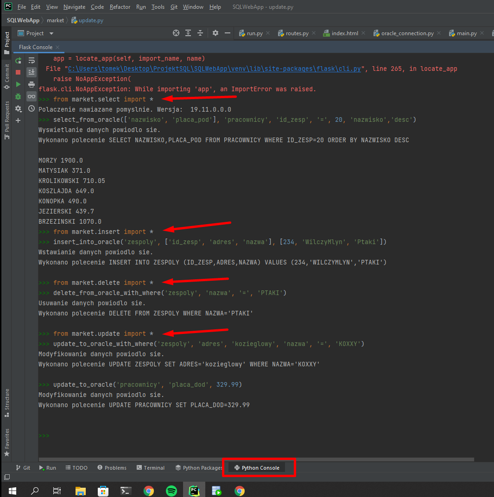

# Opis funkcjonalności aplikacji

Aplikacja do zarządzania zoo. Nasza baza danych będzie opisywała całą strukturę ogrodu zoologicznego. Będziemy się wzorować na naszym ulubionym poznańskim zoo. Dzięki graficznemu interfejsowi można w łatwy sposób panować nad organizacją ogrodu zoologicznego. Niezbędna będzie możliwość dodawania nowych zwierząt z nadanymi ich cechami takich jak między innymi pochodzenie, gatunek, pożywienie oraz umiejsowienie ich w odpowiedniej klatce. W każdej chwili będzie można modyfikować dane o zwierzęciu takie jak np. ilość pożywienia, które dziennie dostaje lub przenosić go do innego miejsca w zoo co naturalnie łączy się z tym, że w każdym momencie będziemy mieli możliwość usunięcia pozycji jakiegoś zwierzęcia. Kolejnym ważnym aspektem w ogrodzie zoologicznym są jego pracownicy działający w różnych zespołach. W dowolnym momencie możemy zwolnić lub zatrudnić nowego pracownika, a każdy z nich ma swoje obowiązki, odpowiednie wynagrodzenie, stanowisko itd. Pracownicy mogą zmieniać swoje zespoły bądź awansować i dostać nowe stanowisko lub pensję. Istotne informacje dotyczące karmienia także można modyfikować odpowiednio dobierając pożywienie, pory karmienia i ilość indywidualnie do gatunku zwierzęcia. Jeżeli nasz obiekt się rozbudowuje możemy dodać nowe części zoo, pawilony lub klatki. Rodzaje biletów wstępu są stałe, ale ich ceny mogą się zmieniać.

 

# Diagram związków encji

 

# Schemat relacyjny

 

# Ogólna instrukcja obsługi projektu

Przede wszystkim musisz pobrać instant client'a Oracle, który tak naprawdę jest tym samym co SQLDeveloper, ale bez GUI.
Dzięki temu możemy połączyć pythona z naszą bazą: https://www.oracle.com/database/technologies/instant-client/winx64-64-downloads.html

1. Utwórz na pulpicie folder *ProjektSQL*.

2. Następnie wypakuj z pobranego Rar'a folder *"Instaclient <wersja pewnie 21.3 czy coś>"* z instaclientem.

3. Wrzuć cały powyższy folder do folderu *ProjektSQL*.

4. W folderze *ProjektSQL* wykonaj komende: 

    `git clone https://github.com/tomaszpiescikowski/SQLWebApp.git`

### Następne kroki
- Stwórz wirtualne środowisko w python'ie

- W folderze znajduje się plik ***requirements.txt***

- Wykonaj komende `python -m pip install -r requirements.txt`

Teraz masz zaistalowane wszystkie potrzebne aktualnie biblioteki i mamy dokładnie takie same środowiska.

# Instrukcja obsługi funkcji moich funkcji SQL

## **Ważne rzeczy**

Jak już odpalisz projekt, to możesz zobaczyć jak działają funkcje. 

***Uruchom server w run.py***, a potem przejdź do zakładki python console na dole.

Powyżej masz screena z rzeczami, które trzeba wpisać. Ogólnie jak wprowadza się jakieś zmiany, to trzeba zresetować tą konsole pythonową i jeszcze raz importować te rzeczy. 

A po co w ogóle ta konsola? 
- Po to, żeby można było testować te funkcje na bieżąco, bo narazie nie mamy interfejsu graficznego itp. Więc warto tego używać. 

No i zmień sobie ustawienia clienta w ***\_\_init\_\_.py*** na swoje dane, żeby ***działać się na swoim koncie***. 

Możesz mieć równocześnie otwarty SQLDeveloper i sobie sprawdzać, że rzeczywiście wszystko się zmienia i działa jak należy. Te funkcje są oczywiście to dopracowania, ale póki co fajnie działają jaka komunikacja z bazą. 

